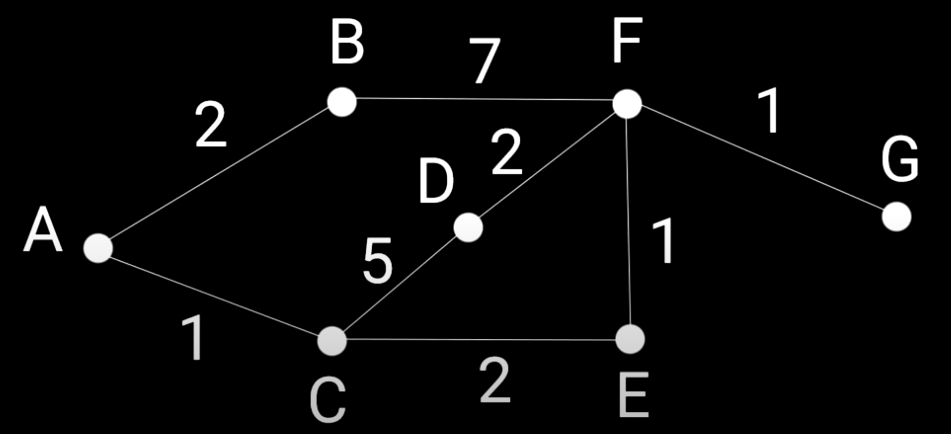

# Алгоритм Дейкстры `Dijkstra Algorithm`

Алгоритм Дейкстры — это алгоритм поиска кратчайших путей между узлами в графе, который может представлять, например, дорожные сети.

Алгоритм существует во многих вариантах; Первоначальный вариант Дейкстры нашел кратчайший путь между двумя узлами, но более распространенный вариант фиксирует один узел как «исходный» узел и находит кратчайшие пути от источника ко всем другим узлам в графе, создавая дерево кратчайших путей.


Алгоритм Дейкстры для поиска кратчайшего пути между aи b. Он выбирает непосещенную вершину с наименьшим расстоянием, вычисляет расстояние через нее до каждого непосещенного соседа и обновляет расстояние до соседа, если оно меньше. Отметить посещение (установлено красным), когда закончите с соседями.

## Примеры

- [Пример 1 - реализация алгоритм дейкстры](#Пример-1)

---

### Пример 1



### `Шаг 1`

_Заготовка_

````js
// Поиск кратчайшего пути в графе А(start) до В(end)
function shortPath(graph, start, end) {

  // таблица результатов после обхода графа полностью
  return costs
}

const graph = {
  a: {b: 2, c: 1},

  b: {f: 7},

  c: {d: 5, e: 2},

  d: {f: 2},

  e: {f: 1},

  f: {g: 1},

  g: {}
}

let start = 'a',
    end = 'g'

// вывод
console.log(shortPath(graph, start, end))
````

### `Шаг 2`

_Заполнить все вершины до которых мы можем добраться из стартовой точки значениями, а все остальные вершины заполнить бесконечно каким-то большим числом._

````js
// Поиск кратчайшего пути в графе А до В
function shortPath(graph, start, end) {

  // таблица которыя хранит кратчайшие пути(стоимость путей)
  const costs = {}

  // хранит узлы(вершины) которые мы уже проверили
  const processed = []

  // хранит соседние вершины рассматриваемого узла
  let neighbors = {}

  // заполнить все вершины до которых мы можем добраться из стартовой точки значениями,
  // а все остальные вершины заполнить бесконечно каким-то большим числом
  Object.keys(graph).forEach(node => {
    if (node !== start) {
      let value = graph[start][node]

      costs[node] = {
        value: value || 100000000,
        path : value ? [start] : []
      }
    }
  })// резульата -> {b: { value: 2, path: [ 'a' ] },
    // c: { value: 1, path: [ 'a' ] },
    // d: { value: 100000000, path: [] },
    // e: { value: 100000000, path: [] },
    // f: { value: 100000000, path: [] },
    // g: { value: 100000000, path: [] }
  
  // таблица результатов после обхода графа полностью
  return costs
}

const graph = {
  // -> исходник есть в 1 шаге
}

let start = 'a',
    end = 'g'

// вывод
console.log(shortPath(graph, start, end))
````

### `Шаг 3`

_Напишем вспомогательную функцию которая будет находить узел(вершину) с наименьшей стоимостью._

````js
// Поиск кратчайшего пути в графе А до В
function shortPath(graph, start, end) {

  // таблица которыя хранит кратчайшие пути(стоимость путей)
  const costs = {}

  // хранит узлы(вершины) которые мы уже проверили
  const processed = []

  // хранит соседние вершины рассматриваемого узла
  let neighbors = {}

  // заполнить все вершины до которых мы можем добраться из стартовой точки значениями,
  // а все остальные вершины заполнить бесконечно каким-то большим числом
  Object.keys(graph).forEach(node => {
    if (node !== start) {
      let value = graph[start][node]

      costs[node] = {
        value: value || 100000000,
        path : value ? [start] : []
      }
    }
  })

  // найти вершину в которую мы можем попасть из точки start(стартовой точки),
  // путь к которой самый короткий
  let node = findNodeLowestCost(costs, processed) // резульата -> c
  
  // таблица результатов после обхода графа полностью
  return costs
}

// Найдти узел(вершину) с наименьшей стоимостью
function findNodeLowestCost(costs, processed) {
  // минимальные значение
  let lowestCost = 100000000

  // будет хранить узел(вершину) с минимальным значением путь
  let lowestNode;

  // проходимся по таблицы в которой хранится стоимость путей
  Object.keys(costs).forEach(node => {
    // стоимость текущий вершины
    let cost = costs[node].value

    // если стоимость текущий вершины(cost) меньше чем минимальная стоимость(lowestCost)
    // и
    // вершина которую мы расматриваем, не находится в массиве обработанных вершин(processed)
    if (cost < lowestCost && !processed.includes(node)) {
      lowestCost = cost
      lowestNode = node
    }
  })

  return lowestNode
}

const graph = {
  // -> исходник есть в 1 шаге
}

let start = 'a',
    end = 'g'

// вывод
console.log(shortPath(graph, start, end))
````

### `Шаг 4`

_Пока есть вершины(узлы) которые мы еще не обошли, проходимя по каждой в цикле._

````js
// Поиск кратчайшего пути в графе А до В
function shortPath(graph, start, end) {

  // таблица которыя хранит кратчайшие пути(стоимость путей)
  const costs = {}

  // хранит узлы(вершины) которые мы уже проверили
  const processed = []

  // хранит соседние вершины рассматриваемого узла
  let neighbors = {}

  // заполнить все вершины до которых мы можем добраться из стартовой точки значениями,
  // а все остальные вершины заполнить бесконечно каким-то большим числом
  Object.keys(graph).forEach(node => {
    if (node !== start) {
      let value = graph[start][node]

      costs[node] = {
        value: value || 100000000,
        path : value ? [start] : []
      }
    }
  })

  // найти вершину в которую мы можем попасть из точки start(стартовой точки),
  // путь к которой самый короткий
  let node = findNodeLowestCost(costs, processed) // резульата -> c

  // запускам цикл пока все вешнины в costs не попадут processed. т.е пока необойдем весь граф
  while (node) {
    // стоимость текущий вершины
    const cost = costs[node].value
    // узлы в которые мы можем попасть их текущий вершины
    neighbors = graph[node]

    // проходимся по узлам
    Object.keys(neighbors).forEach(neighbor => {
      // новый кратчайшие пути (новая стоимость)
      let newCost = cost + neighbors[neighbor]

      // если новый кратчайшие путь(newCost) мненьше чем, кратчайшие путь который лежит в таблицы(costs), обновляем
      if (newCost < costs[neighbor].value) {
        costs[neighbor].value = newCost
        costs[neighbor].path = [...costs[node].path, node]
      }
    })

    // вершину(node) которую мы расматривали на итерации, надо добавить в массив уже обработанных вершин
    // после чего при поиски новой вершины с минимальной стоимостью эта вершина учитываться на будет
    processed.push(node)

    // найти новую вершину с самым коротким путем(наименьшей стоимостью)
    node = findNodeLowestCost(costs, processed)
  }
  
  // таблица результатов после обхода графа полностью
  return costs
}

// Найдти узел(вершину) с наименьшей стоимостью
function findNodeLowestCost(costs, processed) {
  // минимальные значение
  let lowestCost = 100000000

  // будет хранить узел(вершину) с минимальным значением путь
  let lowestNode;

  // проходимся по таблицы в которой хранится стоимость путей
  Object.keys(costs).forEach(node => {
    // стоимость текущий вершины
    let cost = costs[node].value

    // если стоимость текущий вершины(cost) меньше чем минимальная стоимость(lowestCost)
    // и
    // вершина которую мы расматриваем, не находится в массиве обработанных вершин(processed)
    if (cost < lowestCost && !processed.includes(node)) {
      lowestCost = cost
      lowestNode = node
    }
  })

  return lowestNode
}

const graph = {
  // -> исходник есть в 1 шаге
}

let start = 'a',
    end = 'g'

// вывод
console.log(shortPath(graph, start, end))
````


