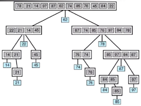

# Быстрая сортировка `Quicksort`

Быстрая сортировка — это алгоритм «разделяй и властвуй». Быстрая сортировка сначала делит большой массив на два меньших подмассива: младшие элементы и старшие элементы. Затем Quicksort может рекурсивно сортировать подмассивы.

Шаги:

1. Выберите из массива элемент, называемый сводной точкой.
2. Разделение: переупорядочить массив так, чтобы все элементы со значениями меньше, чем опорная точка, располагались перед опорной точкой, а все элементы со значениями, превышающими опорную, шли после нее (равные значения могут идти в любом случае). После этого разбиения стержень занимает свое конечное положение. Это называется операцией разделения.
3. Рекурсивно примените вышеуказанные шаги к подмассиву элементов с меньшими значениями и отдельно к подмассиву элементов с большими значениями.

Анимированная визуализация алгоритма быстрой сортировки. Горизонтальные линии являются опорными значениями.

  


## Сложность

|      Наименование       |    Лучший случай    | Средний случай | Худший случай |   Память   | Устойчивость |                                           Комментарии                                           |
|:-----------------------:|:-------------------:|:--------------:|:-------------:|:----------:|:------------:|:-----------------------------------------------------------------------------------------------:|
| **Быстрая сортировка**  |     `n log(n)`      |   `n log(n)`   |     `n^2`     |  `log(n)`  |    `нет`     | Быстрая сортировка обычно<br> выполняется с использованием <br> O(log(n)) дополнительной памяти |


## Примеры

- [Пример 1 - реализация быстрой сортировки](#Пример-1)

---

### Пример 1

### `Шаг 1`

_Напоминаем, что нам предстоит написать несколько вещей: 1. Разделение массива на опорной точке. 2. Перемещение элементов больше неё направо, меньше — налево. 3. Вызов сортировки на каждой из этих частей._

````js
function quickSort(array) {
  return array;
}

quickSort([5, 3, 2, 1]) // => [1, 2, 3, 5]
quickSort([1, 2, 3]) // => [1, 2, 3]
````

### `Шаг 2`

_Находим опорную точку._

````js
function quickSort(array) {
  // если в массиве 1 или меньше элемент возвращаем этот массив 
  if (array.length <= 1) {
    return array
  }
  
  // находим опорную точку
  let pivotIndex = Math.floor(array.length / 2),
      pivot = array[pivotIndex]
  
  return array;
}

quickSort([5, 3, 2, 1]) // => [1, 2, 3, 5]
quickSort([1, 2, 3]) // => [1, 2, 3]
````

### `Шаг 3`

_Теперь можно написать и «раскидыватель». Рассказать принцип её работы проще по уже готовому коду, так что обратите внимание на комментарии к ней!_

````js
function quickSort(array) {

  // если в массиве 1 или меньше элемент возвращаем этот массив
  if (array.length <= 1) {
    return array
  }

  // находим опорную точку
  let pivotIndex = Math.floor(array.length / 2),
      pivot = array[pivotIndex]

  // сохраняем числа меньше чем опорное число
  let less = []

  // сохраняем числа больше чем опорное число
  let greater = []

  // сохраняем числа равные опорному числу
  let equally = [pivot]

  for(let i = 0; i < array.length; i++) {
    // если номер текущий итерации равен индексу опорный точки, пропускаем
    if(i === pivotIndex) {
      continue
    }

    // если текущий элемент итерации равет опорный точки
    if(array[i] === pivot) {

      // добавлием в центр
      equally.push(array[i])

      // если текущий элемент итерации меньше чем опорная точка
    } else if(array[i] < pivot) {

      // добавлляем в левую сторону
      less.push(array[i])

      // иначе если текущий элемент итерации больше чем опорная точка
    } else {

      // добавлляем в правую сторону
      greater.push(array[i])

    }
  }
  
  return array;
}

quickSort([5, 3, 2, 1]) // => [1, 2, 3, 5]
quickSort([1, 2, 3]) // => [1, 2, 3]
````

### `Шаг 4`

_Осталось дописать непосредственно сортировку. Напомним, что нам нужно лишь вызывать эту же сортировку на каждом подмассиве, пока мы не «спустимся» к разбиениям из одного элемента._

````js
function quickSort(array) {

  // если в массиве 1 или меньше элемент возвращаем этот массив
  if (array.length <= 1) {
    return array
  }

  // находим опорную точку
  let pivotIndex = Math.floor(array.length / 2),
      pivot = array[pivotIndex]

  // сохраняем числа меньше чем опорное число
  let less = []

  // сохраняем числа больше чем опорное число
  let greater = []

  // сохраняем числа равные опорному числу
  let equally = [pivot]

  for(let i = 0; i < array.length; i++) {
    // если номер текущий итерации равен индексу опорный точки, пропускаем
    if(i === pivotIndex) {
      continue
    }

    // если текущий элемент итерации равет опорный точки
    if(array[i] === pivot) {

      // добавлием в центр
      equally.push(array[i])

      // если текущий элемент итерации меньше чем опорная точка
    } else if(array[i] < pivot) {

      // добавлляем в левую сторону
      less.push(array[i])

      // иначе если текущий элемент итерации больше чем опорная точка
    } else {

      // добавлляем в правую сторону
      greater.push(array[i])

    }
  }

            // левая часть     // центр      // правая часть
  return [...quickSort(less), ...equally, ...quickSort(greater)];
}

quickSort([5, 3, 2, 1]) // => [1, 2, 3, 5]
quickSort([1, 2, 3]) // => [1, 2, 3]
````


