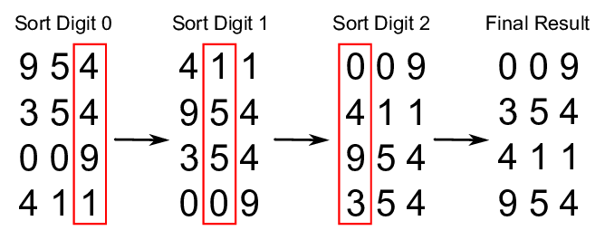

# Поразрядная сортировка `Radix Sort`

В информатике поразрядная сортировка — это несравнительный алгоритм целочисленной сортировки, который сортирует данные с целочисленными ключами, группируя ключи по отдельным цифрам, которые имеют одинаковые значащие позиции и значения. Требуется позиционная запись, но поскольку целые числа могут представлять строки символов (например, имена или даты) и специально отформатированные числа с плавающей запятой, сортировка по основанию не ограничивается целыми числами.

Откуда взялось это имя?

В математических системах счисления основание или основание — это количество уникальных цифр, включая цифру ноль, которые используются для представления чисел в позиционной системе счисления. Например, двоичная система (с использованием чисел 0 и 1) имеет основание 2, а десятичная система (с использованием чисел от 0 до 9) имеет основание 10.

## Эффективность

Тема эффективности поразрядной сортировки по сравнению с другими алгоритмами сортировки несколько сложна и вызывает довольно много недоразумений. Является ли сортировка по основанию одинаково эффективной, менее эффективной или более эффективной, чем лучшие алгоритмы, основанные на сравнении, зависит от деталей сделанных предположений. Сложность сортировки по основанию O(wn)для nключей, которые являются целыми числами размера слова w. Иногда wпредставляется в виде константы, что сделало бы сортировку по основанию лучше (для достаточно больших n), чем лучшие алгоритмы сортировки на основе сравнения, которые все выполняют O(n log n)сравнения для nключей сортировки. Однако в общем случае wнельзя считать константой: если все nключи различны, то wдолжно быть не менееlog nчтобы машина с произвольным доступом могла хранить их в памяти, что дает в лучшем случае временную сложность O(n log n). Казалось бы, это делает сортировку по основанию не менее эффективной, чем лучшая сортировка на основе сравнения (и хуже, если ключи намного длиннее log n).




## Сложность

|        Наименование        | Лучший случай | Средний случай  |  Худший случай   | Память  | Устойчивость |          Комментарии           |
|:--------------------------:|:-------------:|:---------------:|:----------------:|:-------:|:------------:|:------------------------------:|
| **Поразрядная сортировка** |    `n * к`    |     `n * к`     |     `n * к`      | `n * к` |     `да`     | k - длина самого длинного чила |


## Примеры

- [Пример 1 - реализация поразрядная сортировка](#Пример-1)

---

### Пример 1

````js
/**
 * Реализация поразрядная сортировка
 * @param {Array} array - список
 */
function radixSort(array) {
    let position = Array(10).fill(0).map(value => new Queue()), // реализацию new Queue() ищите в example.js
        multiplier = 1,
        maxValue = Math.max(...array)

    while(maxValue-multiplier >= 0) {
        array.forEach( value => {
            let slice = Math.floor(value/multiplier);
            
            position[slice % 10].push(value);
        })

        let indexValue = 0;

        position.forEach(queue => {
            while (queue.lenght > 0)  {
                array[indexValue] = queue.shift();
                
                indexValue++;
            }

        })

        multiplier*=10;
    }

    return array;

}
````