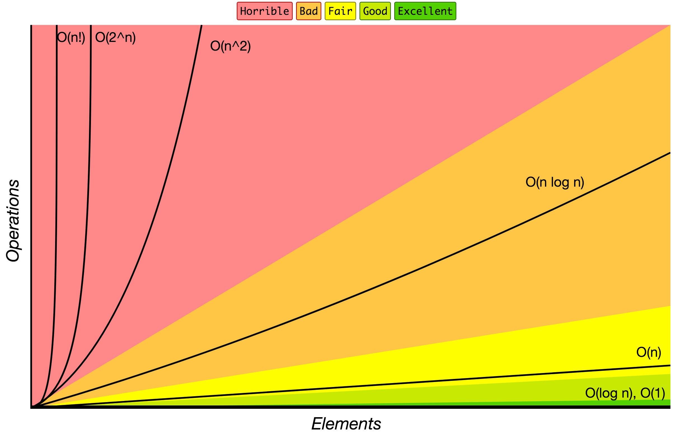

# Big O Notation ( Нотация «О» большое )

Нотация «О» большое используется для классификации алгоритмов в соответствии с ростом времени выполнения и затрачиваемой памяти при увеличении размера входных данных. На диаграмме ниже представлены общие порядки роста алгоритмов в соответствии с нотацией «О» 

Ниже представлены часто используемые обозначения в нотации «О» большое, а также сравнение их производительностей на различных размерах входных данных.

| Нотация «О» большое | 10 элементов | 100 элементов | 1000 элементов |
| ------------------- | ------------ | ------------- | -------------- |
| **O(1)**            | 1            | 1             | 1              |
| **O(log N)**        | 3            | 6             | 9              |
| **O(N)**            | 10           | 100           | 1000           |
| **O(N log N)**      | 30           | 600           | 9000           |
| **O(N^2)**          | 100          | 10000         | 1000000        |
| **O(2^N)**          | 1024         | 1.26e+29      | 1.07e+301      |
| **O(N!)**           | 3628800      | 9.3e+157      | 4.02e+2567     |

### Сложности операций в структурах данных

| Структура данных           | Получение | Поиск     | Вставка   | Удаление  | Комментарии |
| -------------------------- | :-------: | :-------: | :-------: | :-------: | :---------- |
| **Массив**                 | 1         | n         | n         | n         |             |
| **Стек**                   | n         | n         | 1         | 1         |             |
| **Очередь**                | n         | n         | 1         | 1         |             |
| **Связный список**         | n         | n         | 1         | n         |             |
| **Хеш-таблица**            | -         | n         | n         | n         | Для идеальной хеш-функции — O(1) |
| **Двоичное дерево поиска** | n         | n         | n         | n         | В сбалансированном дереве — O(log(n)) |
| **B-дерево**               | log(n)    | log(n)    | log(n)    | log(n)    |           |
| **Красно-чёрное дерево**   | log(n)    | log(n)    | log(n)    | log(n)    |           |
| **АВЛ-дерево**             | log(n)    | log(n)    | log(n)    | log(n)    |           |
| **Фильтр Блума**           | -         | 1         | 1         | -         | Возможно получение ложно-положительного срабатывания |

### Сложности алгоритмов сортировки

| Наименование               | Лучший случай | Средний случай | Худший случай | Память | Устойчивость | Комментарии |
| -------------------------- | :-----------: | :------------: | :-----------: | :----: | :----------: | :---------- |
| **Сортировка пузырьком**   | n             | n2  | n2 | 1      | Да           |             |
| **Сортировка вставками**   | n             | n2  | n2 | 1      | Да           |             |
| **Сортировка выбором**     | n2 | n2  | n2 | 1      | Нет          |             |
| **Сортировка кучей**       | n&nbsp;log(n) | n&nbsp;log(n)  | n&nbsp;log(n) | 1      | Нет          |             |
| **Сортировка слиянием**    | n&nbsp;log(n) | n&nbsp;log(n)  | n&nbsp;log(n) | n      | Да           |             |
| **Быстрая сортировка**     | n&nbsp;log(n) | n&nbsp;log(n)  | n2 | log(n) | Нет          | Быстрая сортировка обычно выполняется с использованием O(log(n)) дополнительной памяти |
| **Сортировка Шелла**       | n&nbsp;log(n) | зависит от выбранных шагов | n&nbsp;(log(n))2  | 1      | Нет          |           |
| **Сортировка подсчётом**   | n + r         | n + r          | n + r         | n + r  | Да           | r — наибольшее число в массиве |
| **Поразрядная сортировка** | n * k         | n * k          | n * k         | n + k  | Да           | k — длина самого длинного ключа |

