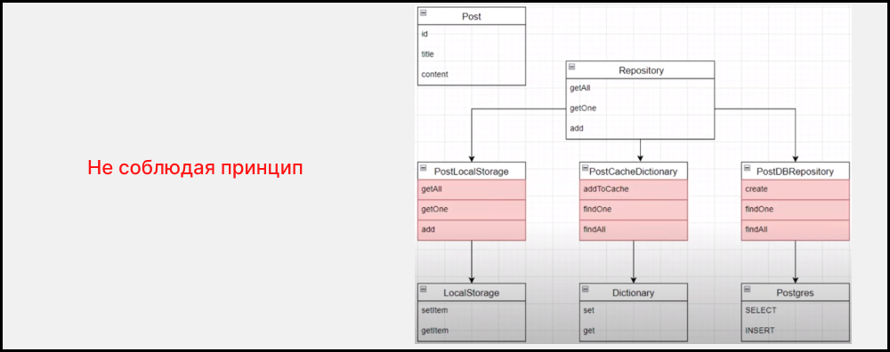
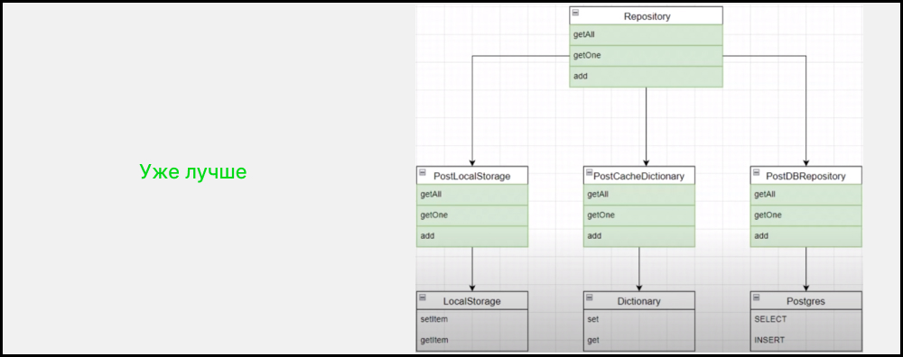
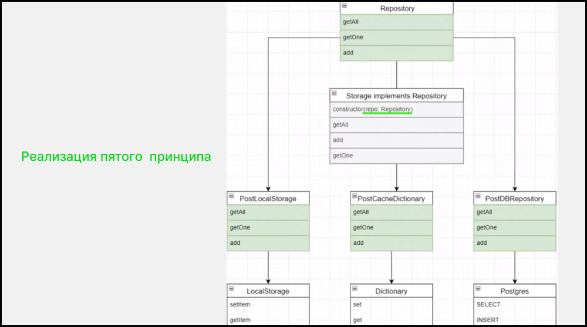

# Dependency inversion principle ( принцип инверсии зависимости )

Модули верхних уровней не должны зависеть от модулей нижних уровней. Оба типа модулей должны зависеть от абстракций. Абстракции не должны зависеть от деталей. Детали должны зависеть от абстракций.

### Схема :







### Примеры

- [Пример 1](#Пример-1)
- [Пример 2](#Пример-2)

---

### Пример 1

### `Вариант который нарушает принцип (плохая практика)`

````js
class Fetch1 {
    request(url) {
        // return fetch(url).then(r => r.json())
        return Promise.resolve('data from fetch')
    }
}

class LocalStorage1 {
    get() {
        const dataFromLocalStorage = 'data from local storage'
        return dataFromLocalStorage
    }
}


class Database1 {
    constructor() {
        //this.fetch = new Fetch()
        this.localStorage = new LocalStorage()
    }

    getData(key) {
        //return this.fetch.request('vk.ru')
        return this.localStorage.get('key')
    }
}


const db1 = new Database()

console.log(db1.getData('rand'))
````
**Объяснение:** _нарушается 2 принцеп открытости и закрытости потому что если поменять Fetch на LocalStorage надо переписывать Database. Так же Database зависит от модулей Fetch или LocalStorage что нарушает принцип инверсии зависимости_

### `Вариант который НЕ нарушает принцип  (хорошая практика)`

````js
class Fetch {
    request(url) {
        // return fetch(url).then(r => r.json())
        return Promise.resolve('data from fetch')
    }
}

class LocalStorage {
    get() {
        const dataFromLocalStorage = 'data from local storage'
        return dataFromLocalStorage
    }
}

class FetchClient {
    constructor() {
        this.fetch = new Fetch()
    }

    clientGet() {
        return this.fetch.request('vk.com')
    }
}

class LocalStorageClient {
    constructor() {
        this.localStorage = new LocalStorage()
    }

    clientGet(key) {
        return this.localStorage.get(key)
    }
}


class Database {
    constructor(client) {
        this.client = client
    }

    getData(key) {
        return this.client.clientGet(key)
    }
}


const db = new Database(new LocalStorageClient())

console.log(db.getData('rand'))
````
**Объяснение:** _Сделали одинаковый интерфейс для методов Fetch и LocalStorage, путем создания абстракции LocalStorage и FetchClient. Database больше не зависит от реализации Fetch или LocalStorage, а от абстракции LocalStorage и FetchClient_ 

---

### Пример 2

### `Вариант который нарушает принцип (плохая практика)`

````ts
class YandexMusicApi1 {
    getTracks(): void {}
}

class SpotifyApi1{
    find(): void {}
}

class VKMusicApi1{
    query(): void {}
}

const MusicApp1 = () => {
    const API = new YandexMusicApi1()

    API.getTracks()
}
````
**Объяснение:** _нарушается 2 принцеп открытости и закрытости, изменяется класс MusicApp. так же MusicApp зависит от деталей модулей YandexMusicApi или SpotifyApi или VKMusicApi что нарушает принцип инверсии зависимости_

### `Вариант который НЕ нарушает принцип (хорошая практика)`

````ts
interface MusicApi {
    getTracks: () => void;
}

class YandexMusicApi implements MusicApi {
    getTracks(): void {}
}

class SpotifyApi implements MusicApi {
    getTracks(): void {}
}

class VKMusicApi implements MusicApi {
    getTracks(): void {}
}

class MusicClient implements MusicApi {
    client: MusicApi;

    constructor(client: MusicApi) {
        this.client = client;
    }

    getTracks() {
        this.client.getTracks();
    }
}

const MusicApp = () => {
    const API = new MusicClient(new SpotifyApi())

    API.getTracks()
}
````
**Объяснение:** _Появился полиморфизм за счет интерфейса MusicApi. Интерфейс класса MusicApp не надо изменять за счет абстракции MusicClient._ 
