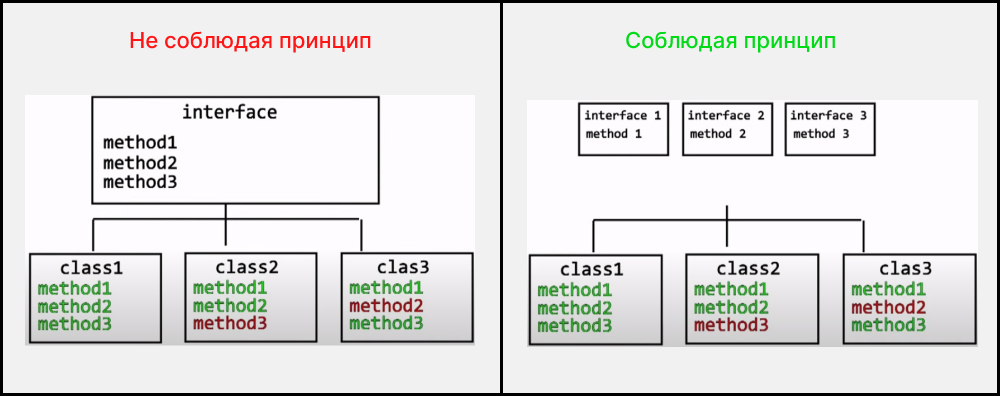
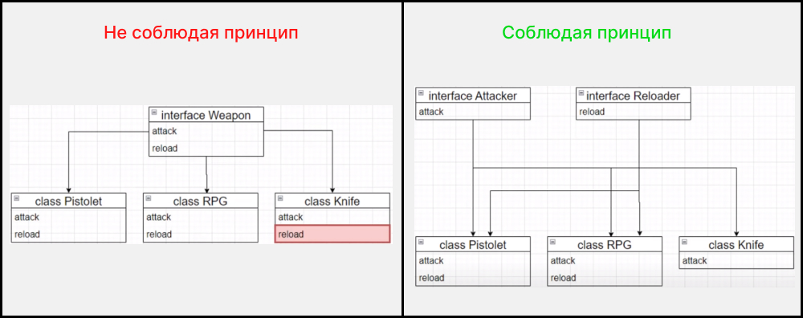

# Interface segregation principle ( принцип разделения интефейсов )

Программные сущности не должны зависеть от методов, которые они не используют.

### Схема :





### Приемущества если писать код соблюдая принцип :

1. Избавить програмные сущности от методов которые они не используют
2. Получаем более предсказуемую работу
3. Код становится менее связным

### Примеры

- [Пример 1](#Пример-1)
- [Пример 2](#Пример-2)

---

### Пример 1

### `Вариант который нарушает принцип (плохая практика)`

````js
class Animal {
    constructor(name) {
        this.name = name
    }

    walk() {
        console.log(`${this.name} умеет ходить`)
    }

    swim() {
        console.log(`${this.name} умеет плавать`)
    }

    fly() {
        console.log(`${this.name} умеет летать`)
    }
}

class Dog extends Animal {
    fly() {
        return null
    }
}

class Eagle extends Animal {
    swim() {
        return null
    }
}

class Whale extends Animal {
    fly() {
        return null
    }

    walk() {
        return null
    }
}
````
**Объяснение:** _Классы Dog Eagle Whale наследуют не нужные методы которые они не реализовывают, это нарушает принцип_

### `Вариант который НЕ нарушает принцип  (хорошая практика)`

````js
class Animal {
    constructor(name) {
        this.name = name
    }
}

const swimmer = {
    swim() {
        console.log(`${this.name} умеет плавать`)
    }
}

const flier = {
    fly() {
        console.log(`${this.name} умеет летать`)
    }
}

const walker = {
    walk() {
        console.log(`${this.name} умеет ходить`)
    }
}

class Dog extends Animal {}
class Eagle extends Animal {}
class Whale extends Animal {}

Object.assign(Dog.prototype, swimmer, walker)
Object.assign(Eagle.prototype, flier, walker)
Object.assign(Whale.prototype, swimmer)

const dog = new Dog('Рэкс')
dog.walk()
dog.swim()

const eagle = new Eagle('Орел')
eagle.fly()
eagle.walk()

const whale = new Whale('Большой синий друг')
whale.swim()
````
**Объяснение:** _принцип не нарушен Dog Eagle Whale наследуют только нужные методы_ 

---

### Пример 2

### `Вариант который нарушает принцип (плохая практика)`

````ts
const createStore = (initial: any) => {}
const initialData = () => {}

interface IRouter {
    parseUrl: (url) => void;
    navigate: (route: Route) => void;
    attachEventListeners: () => void;
    addQueryParams: (params: Record<string, string>) => void;
}

enum Route {
    ABOUT='about_page',
    HOME='home_page',
}

class Router implements IRouter {
    parseUrl(url) : void {}
    navigate(route: Route): void {}
    attachEventListeners(): void {}
    addQueryParams(params: Record<string, string>): void {}
}


const renderHtmlPage1 = (store: any, url: any) => {
    const router = new Router();
}

const client1 = () => {
    const store = createStore1(initialData);

    const router = new Router();
}

const server1 = (req, res) => {
    const store = createStore1(initialData);


    const htmlPage = renderHtmlPage1(store, req.url)
}
````
**Объяснение:** _Есть один большой интерфейс IRouter который содержит в себе методы и клиента и сервера. Это нарушает принцеп разделения интефейсов_

### `Вариант который НЕ нарушает принцип (хорошая практика) | Решения 1`

````ts
const createStore = (initial: any) => {}
const initialData = () => {}

enum Route {
    ABOUT='about_page',
    HOME='home_page',
}

interface Router {
    parseUrl: (url) => void;
    addQueryParams: (params: Record<string, string>) => void;
}

interface IClientRouter extends Router {
    navigate: (route: Route) => void;
    attachEventListeners: () => void;
}

interface IServerRouter extends Router {
    prepareUrlForClient: (url: string) => void;
}

class ServerRouter implements IServerRouter {
    parseUrl(url): void {}
    addQueryParams(params: Record<string, string>): void {}
    prepareUrlForClient(url: string): void {}
}

class ClientRouter implements IClientRouter {
    addQueryParams(params: Record<string, string>): void {}
    parseUrl(url): void {}
    attachEventListeners(): void {}
    navigate(route: Route): void {}
}

const createDependencyContainer = (router: Router, store) => {
    return {
        getRouter: () => router,
        getStore: () => store,
    }
}

const renderHtmlPage = (store: any, url: any) => {
}

const client = () => {
    const store = createStore(initialData);
    const router = new ClientRouter();

    const di = createDependencyContainer(router, store);
}

const server = (req, res) => {
    const store = createStore(initialData);
    const router = new ServerRouter();

    const di = createDependencyContainer(router, store);

    const htmlPage = renderHtmlPage(store, req.url)
}
````
**Объяснение:** _Разделяем Router и создаем две пололнительные абстракции IClientRouter IServerRouter_ 

### `Вариант который НЕ нарушает принцип (хорошая практика) | Решения 2`

````ts
enum Route {
    ABOUT='about_page',
    HOME='home_page',
}

interface UrlParser {
    parseUrl: (url) => void;
    addQueryParams: (params: Record<string, string>) => void;
}

interface Router {
    navigate: (route: Route) => void;
    attachEventListeners: () => void;
}

interface UrlPreparer {
    prepareUrlForClient: (url: string) => void;
}

class ServerRouter implements UrlParser, UrlPreparer {
    parseUrl(url): void {}
    addQueryParams(params: Record<string, string>): void {}
    prepareUrlForClient(url: string): void {}
}

class ClientRouter implements Router, UrlParser {
    addQueryParams(params: Record<string, string>): void {}
    parseUrl(url): void {}
    attachEventListeners(): void {}
    navigate(route: Route): void {}
}
````
**Объяснение:** _Разделяем Router на в самостоятельных интерфейса UrlParser Router UrlPreparer._
