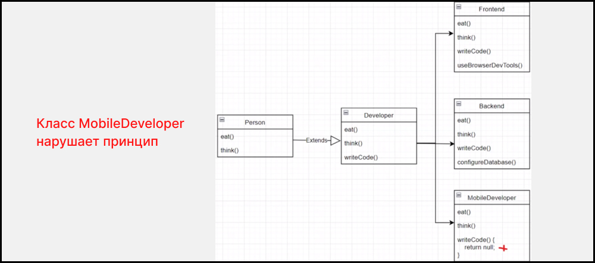

# Liskov substitution principle  ( принцип подстановки Барбары Лисков )

Возможность заменить любой объект родительского класса любым объектом одного из его дочерних классов, не влияя на корректность программы

### Схема :



### Примеры

- [Пример 1](#Пример-1)

---

### Пример 1

### `Вариант который нарушает принцип (плохая практика)`

````js
class Database {
    connect() {}
    read() {}
    write() {}
    joinTables() {}
}

class MySQLDatabase extends Database {
    connect() {}
    read() {}
    write() {}
    joinTables() {}
}

class MongoDatabase extends Database {
    connect() {}
    read() {}
    write() {}
    joinTables() {
        throw new Error('У монго БД нет таблиц')
    }
}


function startApp(database: Database) {
    database.connect()
}
startApp(new MongoDatabase())
startApp(new MySQLDatabase())
````
**Объяснение:** _У класса MongoDatabase не может быть метода joinTables(), а функция startApp на вход приминиет инстанс класса Database. И если передать инстанс MongoDatabase в startApp он будет ожидать что метод joinTables() у него будет реализован._

### `Вариант который НЕ нарушает принцип  (хорошая практика)`

````js
class Database {
    connect() {}
    read() {}
    write() {}
}

class SQLDatabase extends Database {
    connect() {}
    read() {}
    write() {}
    joinTables() {}
}

class NOSQLDatabase extends Database {
    connect() {}
    read() {}
    write() {}
    createIndex() {}
}

class MySQLDatabase extends SQLDatabase {
    connect() {}
    read() {}
    write() {}
    joinTables() {}
}

class MongoDatabase extends NOSQLDatabase {
    connect() {}
    read() {}
    write() {}
    createIndex() {}
    mergeDocuments() {}
}


function startApp(database: Database) {
    database.connect()
}
startApp(new MongoDatabase())
startApp(new MySQLDatabase())
````
**Объяснение:** _Удаляем метод joinTables() из Database, создаем дополнительную абстракцию SQLDatabase и NOSQLDatabase. SQLDatabase для релиционых БД и там реализуем метод joinTables() и от него уже создаем MySQLDatabase. NOSQLDatabase для не релиционых БД и там реализуем метод createIndex() и от него уже создаем MongoDatabase. А функция startApp на вход приминиет инстанс наследуемый от класса Database и там должны быть реализованы методы Database ( connect() | read() |  write() )_ 
