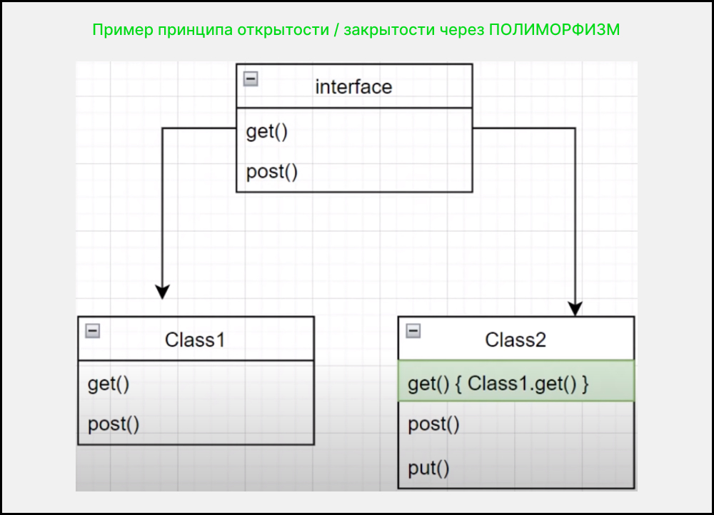

# Open-closed principle  ( принцип открытости / закрытости )

Принцип ООП, устанавливающий следующее положение: «программные сущности (классы, модули, функции и т. п.) должны быть открыты для расширения (**путем композиции и наследования**), но закрыты для изменения».

### Схема :




### Приемущества если писать код соблюдая принцип :

1. Нет необходимости в регрессионном тестировании
2. Меньше вероятность ошибок

### Примеры

- [Пример 1](#Пример-1)
- [Пример 2](#Пример-2)
- [Пример 3](#Пример-3)

---

### Пример 1

### `Вариант который нарушает принцип (плохая практика)`

````js
class Square {
    constructor(size) {
        this.type = 'square'
        this.size = size
    }
}

class Circle {
    constructor(size) {
        this.type = 'circle'
        this.radius = size
    }
}

class AreaCalculator {
    constructor(shapes = []) {
        this.shapes = shapes
    }

    sum() {
        return this.shapes.reduce((acc, shape) => {
            if(shape.type === 'circle') {
                acc += (shape.radius ** 2) * Math.PI
            } else if(shape.type === 'square') {
                acc += shape.size ** 2
            }

            return acc
        }, 0)
    }
}
````
**Объяснение:** _клас AreaCalculator нарушает принцип, потому что для каждой новый фигуры нам нажно изменять метод sum(), что не есть хорошо потому что надо тестировать старый код что бы он не сломался._

### `Вариант который НЕ нарушает принцип  (хорошая практика)`

````js
class Shape {
    area() {
        throw new Error('Area method should be implemented')
    }
}

class Square extends Shape {
    constructor(size) {
        super()
        this.size = size
    }

    area() {
        return this.size ** 2
    }
}

class Circle extends Shape {
    constructor(radius) {
        super()
        this.radius = radius
    }

    area() {
        return (this.radius ** 2) * Math.PI
    }
}

class AreaCalculator {
    constructor(shapes = []) {
        this.shapes = shapes
    }

    sum() {
        return this.shapes.reduce((acc, shape) => {
            acc += shape.area()
            return acc
        }, 0)
    }
}

const calc = new AreaCalculator([
    new Square(10),
    new Circle(1)
])

console.log(calc.sum())
````
**Объяснение:** _создаем класс Shape(фигура) и говорим что все наследники должны реализовать метод area(). Теперь класс AreaCalculator в методе sum() просто вызывает метод area(). Класс Shape расширяется (фигурами кторые наследуют этот класс), а код в классе AreaCalculator не изменяется_ 

---

### Пример 2

### `Вариант который нарушает принцип (плохая практика)`

````ts
class Weapon {
    type : string;
    damage: number; // 0 - 100;
    range: number; // 0 - 100;

    constructor(type: string, damage: number, range: number) {
        this.type = type;
        this.damage = damage;
        this.range = range;
    }

    attack() {
        if(this.type === 'sword') {
            console.log('Удар мечом с уроном' + this.damage);
        }
        if(this.type === 'crossbow') {
            console.log('Выстрел из арболета с уроном' + this.damage);
        }
    }
}

class Character {
    name: string;
    weapon: Weapon;

    constructor(name: string, weapon: Weapon) {
        this.name = name;
        this.weapon = weapon;
    }

    changeWeapon(newWeapon: Weapon) {
        this.weapon = newWeapon;
    }

    attack() {
        this.weapon.attack();
    }
}

const sword = new Weapon('sword', 10, 2)
const character = new Character('Warrior', sword)
character.attack()

const crossbow = new Weapon('crossbow', 50, 10)
character.changeWeapon(crossbow1)
character.attack()
````
**Объяснение:** _Класс Weapon нарушает принчип открытости/закрытости, потому что для каждого оружия надо переписывать метод attack(). Да все работает, но не за счет добавления новый сущности, а за счет изменения старой._

### `Вариант который НЕ нарушает принцип (хорошая практика)`

````ts
interface Attacker {
    attack: () => void;
}
class Weapon implements Attacker {
    damage: number; // 0 - 100;
    range: number; // 0 - 100;

    constructor( damage: number, range: number) {
        this.damage = damage;
        this.range = range;
    }

    attack() {}
}

class Sword extends Weapon {
    attack() {
        console.log('Удар мечом с уроном ' + this.damage)
    }
}

class Crossbow extends Weapon {
    attack() {
        console.log('Выстрел из арбалета с уроном ' + this.damage)
    }
}

class Knife extends Weapon {
    attack() {
        console.log('Удар ножом с уроном ' + this.damage)
    }
}

class Character {
    name: string;
    weapon: Weapon;

    constructor(name: string, weapon: Weapon) {
        this.name = name;
        this.weapon = weapon;
    }

    changeWeapon(newWeapon: Weapon) {
        this.weapon = newWeapon;
    }

    attack() {
        this.weapon.attack();
    }
}

const sword = new Sword(15, 2);
const character = new Character('Warrior', sword);
character.attack()

const crossbow = new Crossbow(40, 100);
character.changeWeapon(crossbow);
character.attack()
````
**Объяснение:** _Добавляем интерфейс Attacker с методом attack() который все наследник должны будут реализовать. При создании нового оружия, сначала создаем класс с названием этого оружия т.е расширяем класс Weapon. все работает, но уже не за счет изменения класса Weapon, а за счет расширения._ 

---

### Пример 3

### `Вариант который нарушает принцип (плохая практика)`

````ts
class BubbleSort {
    public static sort(array: any[]): any[] {
        return array;
    }
}

class QuickSort {
    public static sort(array: any[]): any[] {
        return array;
    }
}

class MergeSort {
    public static sort(array: any[]): any[] {
        return array;
    }
}

class Person {
    fullname: string;

    constructor(fullname: string) {
        this.fullname = fullname;
    }
}

class PersonList {
    persons: Person[]

    constructor(persons: Person[]) {
        this.persons = persons;
    }

    sort() {
        if(this.persons.length < 10) {
            return BubbleSort.sort(this.persons);
        } else if (this.persons.length < 1000 ) {
            return MergeSort.sort(this.persons);
        } else {
            return QuickSort.sort(this.persons)
        }
    }
}

class Music {}

class MusicList {
    musics: Music[]
    constructor(musics: Music[]) {
        this.musics = musics;
    }

    sort() {
        if(this.musics.length < 10) {
            return BubbleSort.sort(this.musics);
        } else if (this.musics.length < 1000 ) {
            return MergeSort.sort(this.musics);
        } else {
            return QuickSort.sort(this.musics)
        }
    }
}

````
**Объяснение:** _дублирует условия в MusicList и PersonList в методе sort() что ни есть хорошо_

### `Вариант который НЕ нарушает принцип (хорошая практика)`

````ts
class Sort {
    public static sort(array: any[]): any[] {return []}
}

class BubbleSort extends Sort{
    public static sort(array: any[]): any[] {
        return array;
    }
}

class QuickSort extends Sort {
    public static sort(array: any[]): any[] {
        return array;
    }
}

class MergeSort extends Sort {
    public static sort(array: any[]): any[] {
        return array;
    }
}

class SortClient extends Sort{
    public static sort(array: any[]): any[] {
        if(array.length < 10) {
            return BubbleSort.sort(array);
        } else if (array.length < 1000 ) {
            return MergeSort.sort(array);
        } else {
            return QuickSort.sort(array)
        }
    }
}

class Person {
    fullname: string;

    constructor(fullname: string) {
        this.fullname = fullname;
    }
}

class PersonList {
    persons: Person[]

    constructor(persons: Person[]) {
        this.persons = persons;
    }
    sort() {
        SortClient.sort(this.persons)
    }
}

class Music {}

class MusicList {
    musics: Music[]
    constructor(musics: Music[]) {
        this.musics = musics;
    }

    sort() {
        SortClient.sort(this.musics)
    }
}
````
**Объяснение:** _создаем абстракцию над сортировками класс SortClient. И делигируем в MusicList и PersonList в метод sort(). И есть нам надо будет добавить сортировку мы делаем это в одном месте SortClient. Пример так же подходит к 5-ому принципу._ 