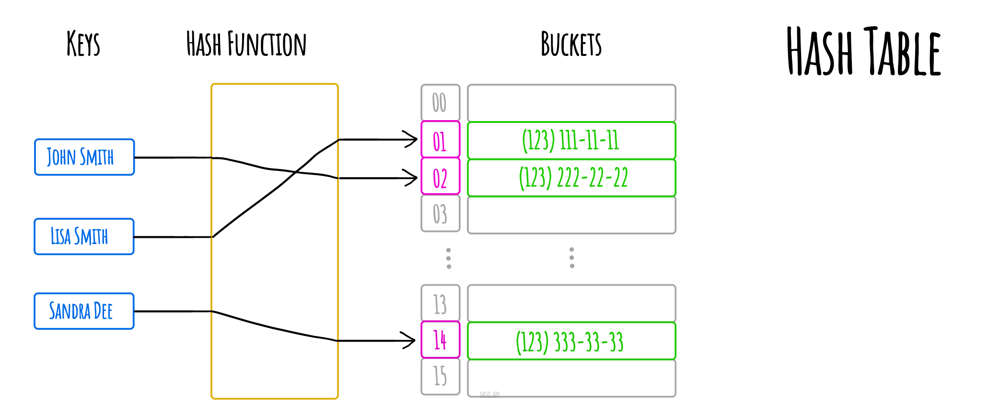
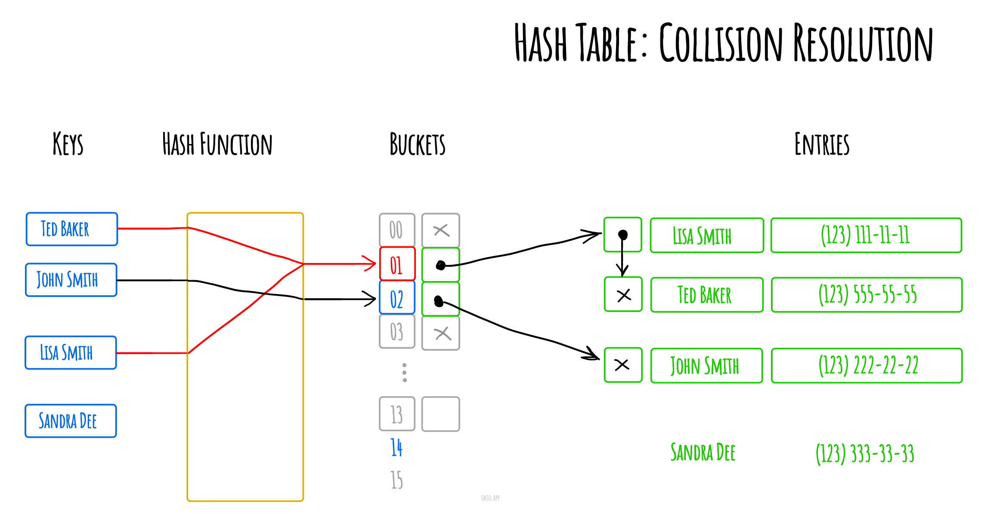
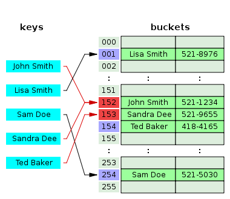

# Хэш таблица `hash-table`

Хеш-таблица - структура данных, реализующая абстрактный тип данных ассоциативный массив, т.е. структура, которая связывает ключи со значениями. Хеш-таблица использует хеш-функцию для вычисления индекса в массиве, в котором может быть найдено желаемое значение. Ниже представлена хеш-таблица, в которой ключом выступает имя человека, а значениями являются телефонные номера. Хеш-функция преобразует ключ-имя в индекс массива с телефонными номерами.



В идеале хеш-функция будет присваивать элементу массива уникальный ключ. Однако большинство реальных хеш-таблиц используют несовершенные хеш-функции. Это может привести к ситуациям, когда хеш-функция генерирует одинаковый индекс для нескольких ключей. Данные ситуации называются коллизиями и должны быть как-то разрешены.

Существует два варианта решения коллизий - хеш-таблица с цепочками и с открытой адресацией.

Метод цепочек подразумевает хранение значений, соответствующих одному и тому же индексу в виде связного списка(цепочки).



Метод открытой адресации помещает значение, для которого получен дублирующий индекс, в первую свободную ячейку.



## Реализация

### Примеры

- [Пример 1 - Реализация хэш таблицы](#Пример-1)

---

### Пример 1

````js
/**
 * Хэш таблица
 */
function HashTable(size = 13) {
    const _store = [];
    const _size = size;

    /**
     * Хэш функция
     * @param {*} value - ключ
     * @return {number}
     */
    function hash(value) {
        let string = String(value),
            index = 0;

        for(let i = 0; i < string.length; i++) {
            index += string.charCodeAt(i) * (i+1);
        }

        return index % _size;
    }

    /**
     * Поиск нужного индекса в массиве по ключу
     * @param {*} list - список
     * @param {string} key - ключ
     * @return {number}
     */
    function findMatchingIndex(list, key) {
        for(let i = 0; i < list.length; i++) {
            if(list[i][0] === key) return i;
        }
    }

    //замыкания
    return {

        // основные операции описаны ниже
        
    }
}

const hashTable = new HashTable();
````

#### Код для основных операций

### `Добавить`

---

_**setElement**_ - записывает по ключу

````js
/**
 * Записывает по ключу
 * @param {*} key - ключ
 * @param {*} value - значение
 * @return {void}
 */
setElement(key, value) {
    if(!key) {
        throw new Error('Некорректный ключ!')
    }

    const index = hash(key);

    if(!_store[index]) {

        _store[index] = [
            [key, value]
        ];

    } else {

        const list = _store[index];
        const matchingIndex = findMatchingIndex(list, key);

        if(matchingIndex || matchingIndex === 0) {
            list[matchingIndex] = [key, value];
            return;
        }

        list.push([key, value]);
    }
}
````

### `Вернуть`

---

_**getElement**_ - возвращает значение по ключу

````js
/**
 * Возвращает значение по ключу
 * @param {*} key - ключ
 * @return {*}
 */
getElement(key) {
    const index = hash(key);

    if(_store[index]) {

        const list = _store[index];

        const matchingIndex = findMatchingIndex(list, key);

        if(matchingIndex || matchingIndex === 0) return list[matchingIndex][1];
    }
}
````

### `Общее`

---

_**dump**_ - возвращает xэш таблицу

````js
/**
 * Возвращает xэш таблицу
 * @return {Array}
 */
dump() {
    return _store;
}
``