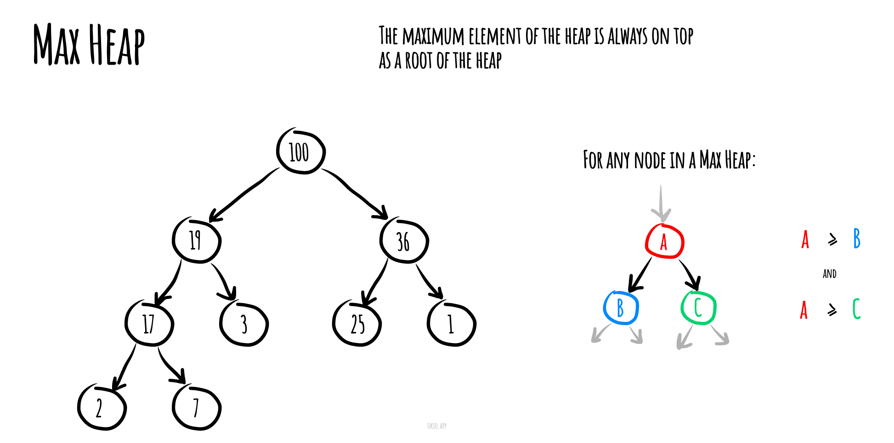

# Куча `heap`

В компьютерных науках куча — это специализированная структура данных типа дерево, которая удовлетворяет свойству кучи: если B является узлом-потомком узла A, то ключ(A) ≥ ключ(B). Из этого следует, что элемент с наибольшим ключом всегда является корневым узлом кучи, поэтому иногда такие кучи называют max-кучами.




Если сравнение перевернуть, то наименьший элемент будет всегда корневым узлом, такие кучи называют min-кучами.


Не существует никаких ограничений относительно того, сколько узлов-потомков имеет каждый узел кучи. На практике их число обычно не более двух. Куча является максимально эффективной реализацией абстрактного типа данных, который называется очередью с приоритетом.

Узел на вершине кучи, у которого нет родителей, называется корневым узлом.

## Сложности времени

Вот временные сложности различных структур данных кучи. Имена функций предполагают максимальную кучу.

| Operation | find-max | delete-max | insert| increase-key| meld |
| --------- | -------- | ---------- | ----- | ----------- | ---- |
| [Binary](https://en.wikipedia.org/wiki/Binary_heap) | `Θ(1)` | `Θ(log n)` | `O(log n)` | `O(log n)` | `Θ(n)` |
| [Leftist](https://en.wikipedia.org/wiki/Leftist_tree) | `Θ(1)` | `Θ(log n)` | `Θ(log n)` | `O(log n)` | `Θ(log n)` |
| [Binomial](https://en.wikipedia.org/wiki/Binomial_heap) | `Θ(1)` | `Θ(log n)` | `Θ(1)` | `O(log n)` | `O(log n)` |
| [Fibonacci](https://en.wikipedia.org/wiki/Fibonacci_heap) | `Θ(1)` | `Θ(log n)` | `Θ(1)` | `Θ(1)` | `Θ(1)` |
| [Pairing](https://en.wikipedia.org/wiki/Pairing_heap) | `Θ(1)` | `Θ(log n)` | `Θ(1)` | `o(log n)` | `Θ(1)` |
| [Brodal](https://en.wikipedia.org/wiki/Brodal_queue) | `Θ(1)` | `Θ(log n)` | `Θ(1)` | `Θ(1)` | `Θ(1)` |
| [Rank-pairing](https://en.wikipedia.org/w/index.php?title=Rank-pairing_heap&action=edit&redlink=1) | `Θ(1)` | `Θ(log n)` | `Θ(1)` | `Θ(1)` | `Θ(1)` |
| [Strict Fibonacci](https://en.wikipedia.org/wiki/Fibonacci_heap) | `Θ(1)` | `Θ(log n)` | `Θ(1)` | `Θ(1)` | `Θ(1)` |
| [2-3 heap](https://en.wikipedia.org/wiki/2%E2%80%933_heap) | `O(log n)` | `O(log n)` | `O(log n)` | `Θ(1)` | `?` |

## Реализация

### Примеры

- [Пример 1 - Минимальная куча](#Пример-1)
- [Пример 2 - Максимальная куча](#Пример-2)

---

### Пример 1

````js
/**
 * Минимальная куча
 */
class MinHeap
{

  /**
   * Конструктор
   * @param {Array} array - список
   */
  constructor(array) {

    this.heap = [null] // куча

    this.sorted = [] // сортирования куча

    // формеруем кучу из исходных данных
    while(array.length > 0)
    {
      this.insert(array.pop());
    }
  }

  // основные операции описаны ниже
}

// сортировка по принцепу минимальной кучи
let minHeap = new MinHeap([5,7,9,4,3,8,3,1,0,3]);
````

#### Код для основных операций

### `Добавить`

---

_**Insert**_ - добавления новый узел в кучу

````js
/**
 * Добавления новый узел в кучу
 * @param {*} node - список
 * @return {void}
 */
insert(node) {

  // вставка нового узла в конец массива кучи
  this.heap.push(node)

  let current = this.heap.length - 1

  // поиск правильной позиции для нового узла

  // Переход вверх по родительскому узлу до тех пор, пока текущий узел (current) не станет больше родительского (current/2)
  while (current > 1 && this.heap[Math.floor(current/2)] > this.heap[current]) {

    // Замена двух узлов с помощью синтаксиса деструктурирования ES6
    [this.heap[Math.floor(current/2)], this.heap[current]] = [this.heap[current], this.heap[Math.floor(current/2)]]

    current = Math.floor(current/2)
  }

}
````

### `Удалить`

---

_**Remove**_ - удалить минимальный узел

````js
/**
 * Удалить минимальный узел
 * @return {*} - узел с минимальным значением
 */
remove() {
  // Наименьший элемент находится с индексом 1 в массиве кучи
  let smallest = this.heap[1]

  // Когда в массиве больше двух элементов, мы помещаем самый правый элемент в первую позицию
  // и начинаем сравнивать узлы с дочерним узлом
  if (this.heap.length > 2) {
    this.heap[1] = this.heap[this.heap.length-1]
    this.heap.splice(this.heap.length - 1)

    if (this.heap.length === 3) {
      if (this.heap[1] > this.heap[2]) {
        [this.heap[1], this.heap[2]] = [this.heap[2], this.heap[1]]
      }
      return smallest
    }

    let current = 1
    let leftChildIndex = current * 2
    let rightChildIndex = current * 2 + 1

    while (this.heap[leftChildIndex] && this.heap[rightChildIndex] &&
    (this.heap[current] > this.heap[leftChildIndex] || this.heap[current] > this.heap[rightChildIndex])) {

      if (this.heap[leftChildIndex] < this.heap[rightChildIndex]) {
        [this.heap[current], this.heap[leftChildIndex]] = [this.heap[leftChildIndex], this.heap[current]]
        current = leftChildIndex
      } else {
        [this.heap[current], this.heap[rightChildIndex]] = [this.heap[rightChildIndex], this.heap[current]]
        current = rightChildIndex
      }

      leftChildIndex = current * 2
      rightChildIndex = current * 2 + 1
    }

    if (this.heap[rightChildIndex] === undefined && this.heap[leftChildIndex] < this.heap[current]) {
      [this.heap[current], this.heap[leftChildIndex]] = [this.heap[leftChildIndex], this.heap[current]]
    }
  }
  // Если в массиве есть только два элемента, мы непосредственно выделяем первый элемент
  else if (this.heap.length === 2) {

    this.heap.splice(1, 1)

  } else {

    return null

  }

  return smallest
}
````

### `Обход`

---

_**Sort**_ - пирамидальная сортировка (сортировка кучи)

````js
/**
 * Пирамидальная сортировка (сортировка кучей)
 * @return {Array} - массив отсортированный по возростанию
 */
sort() {
  while( this.heap.length > 1 ) {
    let value = this.remove(1)

    this.sorted.push(value)
  }

  return this.sorted
}
````

### Пример 2

````js
/**
 * Максимальная куча
 */
class MaxHeap
{

  /**
   * Конструктор
   * @param {Array} array - список
   */
  constructor(array) {

    this.heap = [null] // куча

    this.sorted = [] // сортирования куча

    // формеруем кучу из исходных данных
    while(array.length > 0)
    {
      this.insert(array.pop());
    }
  }

  // основные операции описаны ниже
}

// сортировка по принцепу максимальной кучи
let maxHeap = new MaxHeap([5,7,9,4,3,8,3,1,0,3]);
````

#### Код для основных операций

### `Добавить`

---

_**Insert**_ - добавления новый узел в кучу

````js
/**
 * Добавления новый узел в кучу
 * @param {*} node - список
 * @return {void}
 */
insert(node) {

  // вставка нового узла в конец массива кучи
  this.heap.push(node)

  let current = this.heap.length - 1

  // поиск правильной позиции для нового узла

  // Переход вверх по родительскому узлу до тех пор, пока текущий узел (current) не станет больше родительского (current/2)
  while (current > 1 && this.heap[Math.floor(current/2)] > this.heap[current]) {

    // Замена двух узлов с помощью синтаксиса деструктурирования ES6
    [this.heap[Math.floor(current/2)], this.heap[current]] = [this.heap[current], this.heap[Math.floor(current/2)]]

    current = Math.floor(current/2)
  }

}
````

### `Удалить`

---

_**Remove**_ - удалить максимальный узел

````js
/**
 * Удалить максимальный узел
 * @return {*} - узел с максимальм значением
 */
remove() {
  // Наименьший элемент находится с индексом 1 в массиве кучи
  let smallest = this.heap[1]

  // Когда в массиве больше двух элементов, мы помещаем самый правый элемент в первую позицию
  // и начинаем сравнивать узлы с дочерним узлом
  if (this.heap.length > 2) {
    this.heap[1] = this.heap[this.heap.length-1]
    this.heap.splice(this.heap.length - 1)

    if (this.heap.length === 3) {
      if (this.heap[1] < this.heap[2]) {
        [this.heap[1], this.heap[2]] = [this.heap[2], this.heap[1]]
      }
      return smallest
    }

    let current = 1
    let leftChildIndex = current * 2
    let rightChildIndex = current * 2 + 1

    while (this.heap[leftChildIndex] && this.heap[rightChildIndex] &&
    (this.heap[current] < this.heap[leftChildIndex] || this.heap[current] < this.heap[rightChildIndex])) {

      if (this.heap[leftChildIndex] > this.heap[rightChildIndex]) {
        [this.heap[current], this.heap[leftChildIndex]] = [this.heap[leftChildIndex], this.heap[current]]
        current = leftChildIndex
      } else {
        [this.heap[current], this.heap[rightChildIndex]] = [this.heap[rightChildIndex], this.heap[current]]
        current = rightChildIndex
      }

      leftChildIndex = current * 2
      rightChildIndex = current * 2 + 1
    }

    if (this.heap[rightChildIndex] === undefined && this.heap[leftChildIndex] > this.heap[current]) {
      [this.heap[current], this.heap[leftChildIndex]] = [this.heap[leftChildIndex], this.heap[current]]
    }
  }
  // Если в массиве есть только два элемента, мы непосредственно выделяем первый элемент
  else if (this.heap.length === 2) {

    this.heap.splice(1, 1)

  } else {

    return null

  }

  return smallest
}
````

### `Обход`

---

_**Sort**_ - пирамидальная сортировка (сортировка кучи)

````js
/**
 * Пирамидальная сортировка (сортировка кучей)
 * @return {Array} - массив отсортированный по убыванию
 */
sort() {
  while( this.heap.length > 1 ) {
    let value = this.remove(1)

    this.sorted.push(value)
  }

  return this.sorted
}
````


