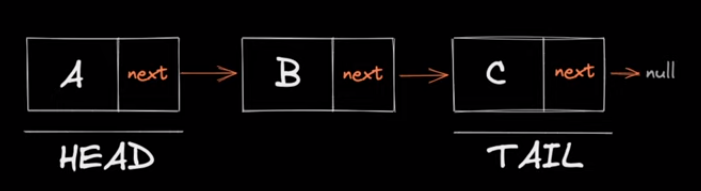
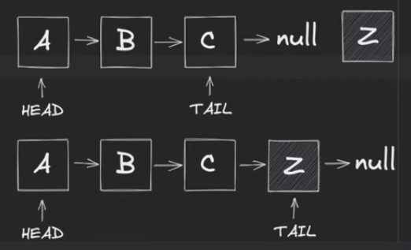
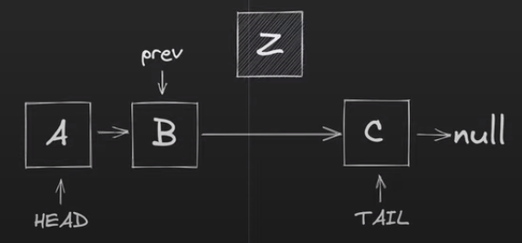
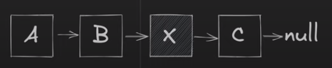
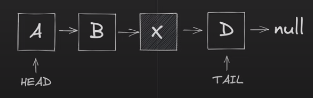

# Связанный список `linked-list`

Связанный список — представляет собой линейный набор элементов данных, линейный порядок которых не определяется их физическим размещением в памяти. Вместо этого каждый элемент указывает на следующий. Это структура данных, состоящая из группы узлов, которые вместе представляют собой последовательность. В простейшей форме каждый узел состоит из данных и ссылки (другими словами, ссылки) на следующий узел в последовательности. Эта структура позволяет эффективно вставлять или удалять элементы из любой позиции последовательности во время итерации. В более сложных вариантах добавляются дополнительные ссылки, позволяющие эффективно вставлять или удалять произвольные ссылки на элементы. Недостатком связанных списков является то, что время доступа является линейным (и его трудно конвейеризировать). Более быстрый доступ, такой как произвольный доступ, невозможен. Массивы имеют лучшую локальность кеша по сравнению со связанными списками.



### Реализация

````js
/**
 * Узел связанного списка
 */
class LinkedListNode {

  /**
   * Конструктор
   * @param {*} value - значение узла
   * @param {Object|null=} next - указатель на следующий узел
   */
  constructor(value, next = null) {
    this.value = value
    this.next = next
  }

  /**
   * Приводит значение в строку и выводит
   */
  toString() {
    return `${this.value}`
  }
}

/**
 * Связанный список
 */
class LinkedList {

  /**
   * Конструктор
   */
  constructor() {
    this.head = null // голова
    this.tail = null // хвост
  }
  
  // основные операции над списком описаны ниже
}
````

### Код для основных операций

### `Добавить`

---

_**Prepend**_ - добавление в начала списка


````js
/**
 * Добавление в начала списка
 * Сложность: O(1)
 * @param {*} value - значение нового узла
 */
prepend(value) {
  const newNode = new LinkedListNode(value, this.head)

  this.head = newNode

  if(!this.tail) {
    this.tail = newNode
  }

  return this
}
````
_**Append**_ - добавление в конец списка



````js
/**
 * Добавление в конец списка
 * Сложность: O(1)
 * @param {*} value - значение нового узла
 */
append(value) {
  const newNode = new LinkedListNode(value)

  if(!this.head || !this.tail) {
    this.head = newNode
    this.tail = newNode

    return this
  }

  this.tail.next = newNode
  this.tail = newNode

  return this
}
````

_**InsertAfter**_ - добавить новый узел после уже существующего узла



````js
/**
 * Вставить новый узел после уже существующего узла
 * Сложность: O(n)
 * @param {*} value - значение нового узла
 * @param {Object} prevNode - узел после которого будет ставлять новый узел
 */
insertAfter(value, prevNode) {
  if(prevNode === null) {
    return this
  }

  const newNode = new LinkedListNode(value)

  newNode.next = prevNode.next

  prevNode.next = newNode

  if(newNode.next === null) {
    this.tail = newNode
  }

  return this
}
````

### `Поиск`

---

_**Find**_ - Поиск узла в связанным списке



````js
/**
 * Поиск узла в связанным списке
 * Сложность: O(n)
 * @param {*} value - значение для поиска
 */
find(value) {
  if(!this.head) {
    return null
  }

  let currentNode = this.head

  while (currentNode) {
    if(currentNode.value === value) {
      return currentNode
    }

    currentNode = currentNode.next
  }

  return null
}
````

### `Удалить`

---

_**Delete**_ - удаления узлов из связного списка



````js
/**
 * Удаления узлов из связного списка
 * Сложность: O(n)
 * @param {*} value - значение для удаления
 */
delete(value) {
  if (!this.head) {
    return null
  }

  let deletedNode = null

  while (this.head && this.head.value === value) {
    deletedNode = this.head

    this.head = this.head.next
  }

  let currentNode = this.head

  if(currentNode !== null) {
    while (currentNode.next) {
      if(currentNode.next.value === value) {
        deletedNode = currentNode.next
        currentNode.next = currentNode.next.next
      } else {
        currentNode = currentNode.next
      }
    }
  }

  if(this.tail?.value === value) {
    this.tail = currentNode
  }

  return deletedNode
}
````

### `Обход`

---

````js
/**
 * Выводит связанный список в виде массива
 * Сложность: O(n)
 */
toArray() {
  const nodes = []

  let currentNode = this.head

  while (currentNode) {
    nodes.push(currentNode)

    currentNode = currentNode.next
  }

  return nodes
}
````

````js
/**
 * Выводит связанный список в виде строки
 * Сложность: O(n)
 */
toString() {
  return this.toArray().map(node => node.toString()).toString()
}
````


