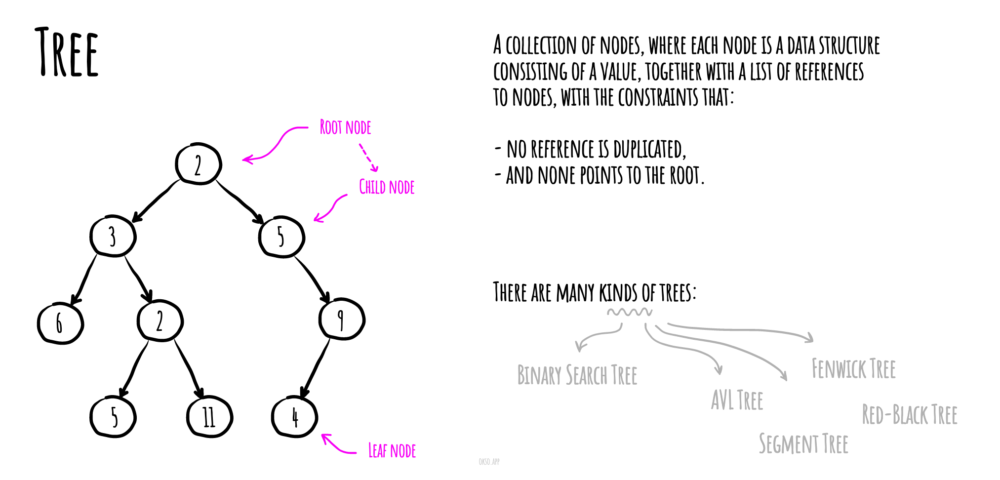

# Дерево `Tree`

В информатике дерево — это широко используемый абстрактный тип данных (ADT) — или структура данных, реализующая этот ADT — которая имитирует иерархическую древовидную структуру с корневым значением и поддеревьями дочерних элементов с родительским узлом, представленным в виде набора связанных узлы.

Древовидная структура данных может быть определена рекурсивно (локально) как набор узлов (начиная с корневого узла), где каждый узел представляет собой структуру данных, состоящую из значения вместе со списком ссылок на узлы («дочерние элементы») , с ограничениями, что ни одна ссылка не дублируется и не указывает на корень.

Простое неупорядоченное дерево; на этой диаграмме узел с номером 7 имеет двух дочерних элементов с номерами 2 и 6 и одного родителя с номером 2. Корневой узел вверху не имеет родителя.

