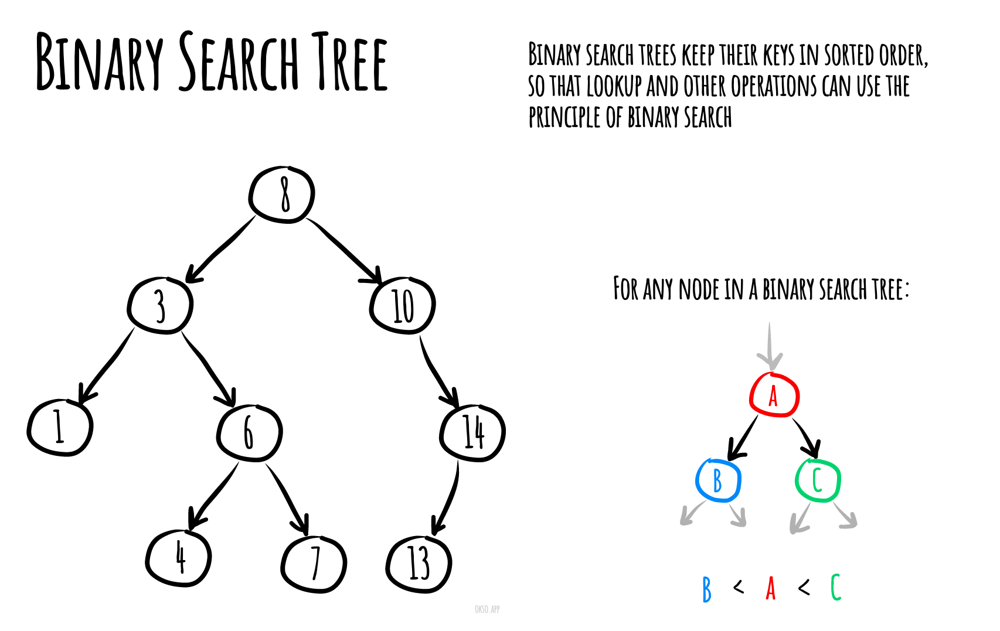

# Бинарное дерево поиска `Binary Search Tree`

В информатике бинарные деревья поиска (BST), иногда называемые упорядоченными или отсортированными бинарными деревьями, представляют собой особый тип контейнера: структуры данных, которые хранят «элементы» (такие как числа, имена и т. д.) в памяти. Они обеспечивают быстрый поиск, добавление и удаление элементов и могут использоваться для реализации либо динамических наборов элементов, либо таблиц поиска, позволяющих находить элемент по его ключу (например, находить номер телефона человека по имени).

Двоичные деревья поиска сохраняют свои ключи в отсортированном порядке, так что поиск и другие операции могут использовать принцип бинарного поиска: при поиске ключа в дереве (или места для вставки нового ключа) они проходят дерево от корня к листа, выполняя сравнения с ключами, хранящимися в узлах дерева, и на основе сравнения решая, продолжить ли поиск в левом или правом поддеревьях. В среднем это означает, что каждое сравнение позволяет операциям пропустить примерно половину дерева, так что каждый поиск, вставка или удаление занимает время, пропорциональное логарифму числа элементов, хранящихся в дереве. Это намного лучше, чем линейное время, необходимое для поиска элементов по ключу в (несортированном) массиве, но медленнее, чем соответствующие операции с хеш-таблицами.

Двоичное дерево поиска размером 9 и глубиной 3, с 8 в корне. Листья не прорисованы.



### Сложности

---

Сложность времени

| Получение  |   Поиск   |  Вставка  | Удаление  |
|:----------:|:---------:|:---------:|:---------:|
| O(log(n))  | O(log(n)) | O(log(n)) | O(log(n)) |

### Реализация

````js
/**
 * Узел
 */
class Node {

    /**
     * Конструктор
     * @param {*} value - значение узла
     */
    constructor(value) {
        this.value = value
        this.left = null
        this.right = null
    }

    /**
     * Приводит значение в строку и выводит
     * @return {string}
     */
    toString() {
        return `${this.value}`
    }
}

/**
 * Бинарное дерево
 */
class BinaryTree {

    /**
     * Конструктор
     */
    constructor() {
        this.root = null // ссылка на последний узел
    }

    // основные операции над деревом описаны ниже
}
````

### Код для основных операций

### `Добавить`

---

_**Add**_ - добавляет узел

````js
/**
 * Добавляет узел
 * Сложность: O(log(n))
 * @param {*} value - значение нового узла
 * @return {void}
 */
add(value) {
    const newNode = new Node(value)

    if(!this.root) {
        this.root = newNode

        return
    }

    let currentNode = this.root

    while (currentNode) {
        if(newNode.value < currentNode.value) {
            // добавляем в левую сторону
            if(!currentNode.left) {
                currentNode.left = newNode

                return;
            }

            currentNode = currentNode.left

        } else {
            // добавляем в правую сторону
            if(!currentNode.right) {
                currentNode.right = newNode

                return;
            }

            currentNode = currentNode.right
        }
    }

}
````

### `Поиск`

---

_**Find**_ - поиск по дереву

````js
/**
 * Поиск по дереву
 * @param {*} value - значение для поиска
 * @return {Object} - узел
 */
find(value) {
    let currentNode = this.root

    while (currentNode) {

        if(currentNode.value === value) {
            return currentNode
        }

        if(value < currentNode.value) {
            // ищем в левой ветки
            currentNode = currentNode.left

        } else {
            // ищем в правой ветки
            currentNode = currentNode.right

        }
    }

    return -1
}
````

### `Одход`

---

_**TraverseDFS**_ - обход в глубину

````js
  /**
 * Обход в глубину
 * @param {Function} callback - колбэк функция
 * @param {string} method - когда вызывать колбэк
 * @return {void}
 */
traverseDFS(callback, method) {
    if (method === 'preOrder') {
        this.preOrder(this.root, callback)
        return
    }

    if(method === 'inOrder') {
        this.inOrder(this.root, callback)
        return
    }

    this.postOrder(this.root, callback)
}

/**
 * Алгоритм:
 * 1) Действие с Node
 * 2) Идем по левому под дереву
 * 3) Идем по правому под дереву
 * @param {Object} node - узел
 * @param {Function} callback - колбэк функция
 * @return {void}
 */
preOrder(node,callback) {
    if(!node) {
        return
    }

    if(callback) {
        callback(node)
    }

    this.preOrder(node.left, callback)
    this.preOrder(node.right, callback)
}

/**
 * Алгоритм:
 * 1) Идем по левому под дереву
 * 2) Действие с Node
 * 3) Идем по правому под дереву
 * @param {Object} node - узел
 * @param {Function} callback - колбэк функция
 * @return {void}
 */
inOrder(node,callback) {
    if(!node) {
        return
    }

    this.inOrder(node.left, callback)

    if(callback) {
        callback(node)
    }

    this.inOrder(node.right, callback)
}

/**
 * Алгоритм:
 * 1) Идем по левому под дереву
 * 2) Идем по правому под дереву
 * 3) Действие с Node
 * @param {Object} node - узел
 * @param {Function} callback - колбэк функция
 * @return {void}
 */
postOrder(node,callback) {
    if(!node) {
        return
    }

    this.postOrder(node.left, callback)
    this.postOrder(node.right, callback)

    if(callback) {
        callback(node)
    }
}
````

_**TraverseBFS**_ - обход в ширину

````js
/**
 * Обход в ширину
 * @param {Function} callback - колбэк функция
 * @return {void}
 */
traverseBFS(callback) {
    const queue = [this.root];

    while (queue.length) {
        const node = queue.shift();

        if(callback) {
            callback(node)
        }

        if(node.left) {
            queue.push(node.left)
        }

        if(node.right) {
            queue.push(node.right)
        }
    }
}
````